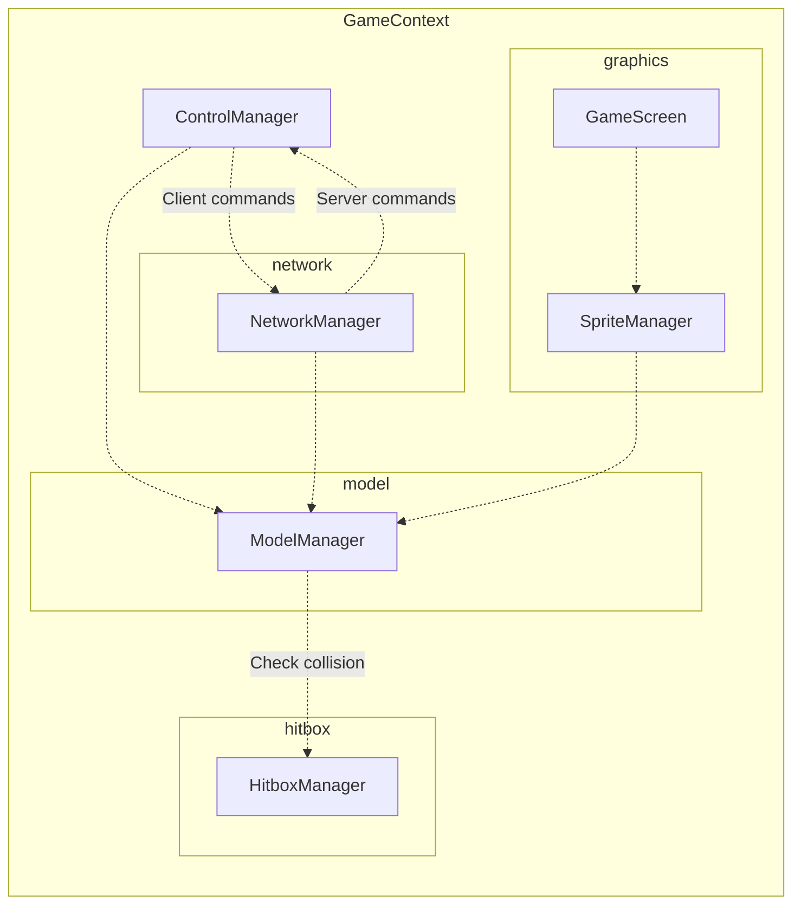

# console-color

## Architecture

### Overall architecture
```
GameContext
- TimeManager
- ControlManager
- NetworkManager
- ModelManager
- SpriteManager
- HitboxManager
- GameScreen
```

### Interaction graph


## Commands

```bash
# Server
mvn compile exec:java -Dexec.mainClass="com.noiprocs.App" -Dexec.args="pc gnik server localhost 8080"

# Client noiprocs
mvn compile exec:java -Dexec.mainClass="com.noiprocs.App" -Dexec.args="pc noiprocs client localhost 8080"

# Client yaiba
mvn compile exec:java -Dexec.mainClass="com.noiprocs.App" -Dexec.args="pc yaiba client localhost 8080"

# Assembly
mvn assembly:single
```

## Control

- A D W S : Movement
- H: Stop
- F: Trigger action
- T: Use current item
- 1 2 3 4: Switch item in inventory.

## Component in details
### ServerMessageQueue

The idea of `ServerMessageQueue` is to have a background thread to broadcast message to all clients asynchronously.
This reduces the process time of each frame. However, enabling background thread causes several issues:
- Corrupted serialization data: When object is serialized, its attributes are updated by another thread. This causes serialized data to be corrupted.
- `ConcurrentModificationException`: While looping through collections to serialize data, if that collection is updated by another thread, it throws `ConcurrentModificationException`.
Disabled background thread, broadcast step takes average of 2ms (Measured on 2025-03-28).

### ModelManager

- Models are being processed in parallel. This causes race condition when 2 models are trying to move into the same position.
- Disable parallel processing to benchmark the performance and improvement of each step.

### HitboxManager

- Hitbox is draw using `model.posX`, `model.posY`, `model.hitboxHeight` and `model.hitboxWidth`.
- Position (`model.posX`, `model.posY`) presents top left corner of hitbox rectangle.

## How to benchmark performance

1. Delete save file `last_checkpoint.dat`.
2. Increase `ModelChunk.CHUNK_HEIGHT` and `ModelChunk.CHUNK_WIDTH` to force all models to be processed (by being in 1 chunk).
3. Start server and start 1 client.
4. Record the measurement.

## Improvements
### Future improvements

- Fix bugs and remove try / catch or move try / catch in proper positions.
- Improve HitboxManager - isValid method with moving vector.
    - At the moment, we loop and check whether each step is valid.
    - The better way is to check for the moving vector and get the position which model could move to.
- Make ModelManager abstract, separate into ClientModelManager and ServerModelManager.
- Review the use of `parallelStream`, measure the performance.

### Past Improvements

- Divided ModelManager into chunks.
- Broadcast data to client asynchronously.
- Use better serializer (i.e Kryo, ...). Issue with Java serializer: When object's attributes are updated while object is serialized, this caused serialized data to be corrupted.
- Use netty for communication via network.
