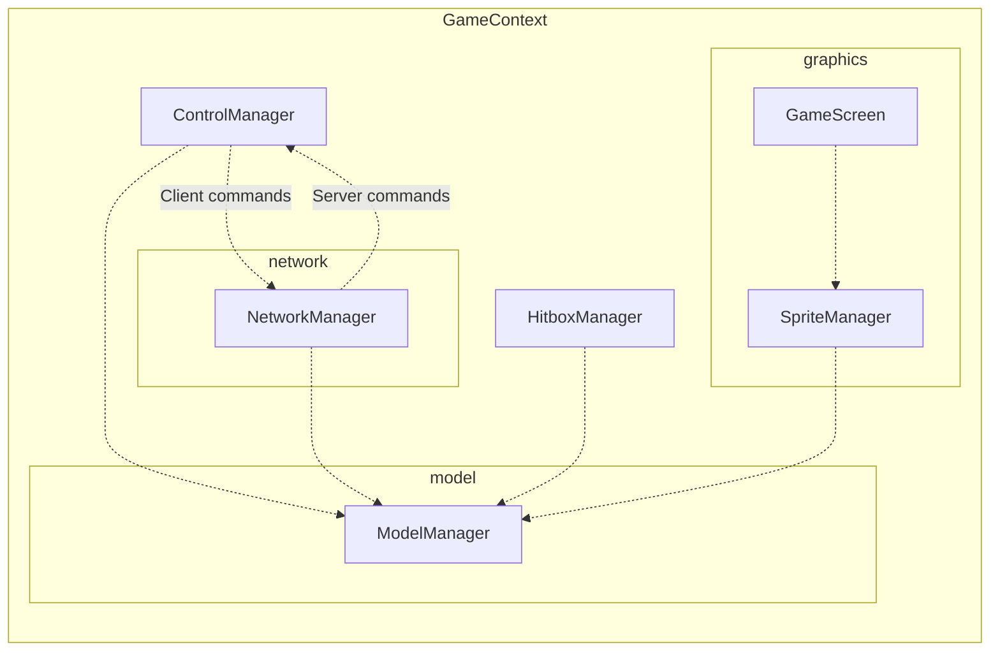

# console-color

## Architecture

### Overall architecture
```
GameContext
- TimeManager
- ControlManager
- NetworkManager
- ModelManager
- SpriteManager
- HitboxManager
- GameScreen
```

### Interaction graph


## Commands

```bash
# Server
mvn compile exec:java -Dexec.mainClass="com.noiprocs.App" -Dexec.args="pc gnik server localhost 8080"

# Client noiprocs
mvn compile exec:java -Dexec.mainClass="com.noiprocs.App" -Dexec.args="pc noiprocs client localhost 8080"

# Client yaiba
mvn compile exec:java -Dexec.mainClass="com.noiprocs.App" -Dexec.args="pc yaiba client localhost 8080"

# Assembly
mvn assembly:single
```

## Control

- A D W S : Movement
- H: Stop
- F: Trigger action
- T: Use current item
- 1 2 3 4: Switch item in inventory.

## Future improvement

- Broadcast data to client asynchronously.
- Use netty for network.

## Improvements

- Divided ModelManager into chunks.

