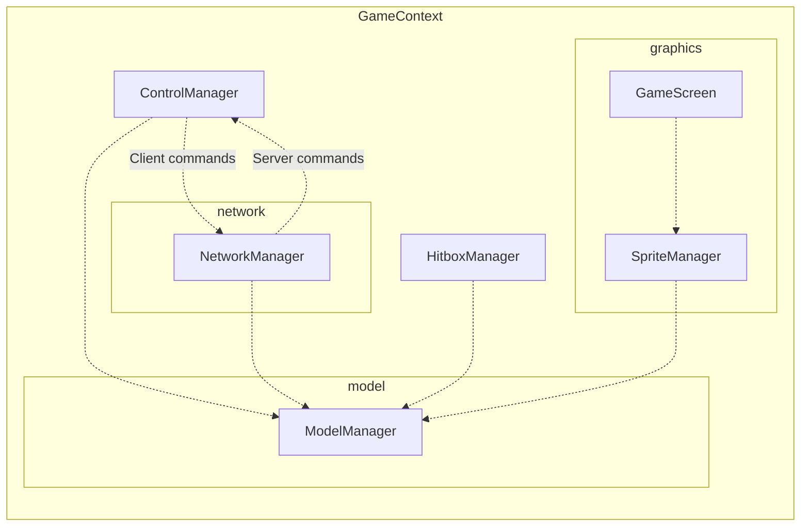

# console-color

## Architecture

### Overall architecture
```
GameContext
- TimeManager
- ControlManager
- NetworkManager
- ModelManager
- SpriteManager
- HitboxManager
- GameScreen
```

### Interaction graph


## Commands

```bash
# Server
mvn compile exec:java -Dexec.mainClass="com.noiprocs.App" -Dexec.args="pc gnik server localhost 8080"

# Client noiprocs
mvn compile exec:java -Dexec.mainClass="com.noiprocs.App" -Dexec.args="pc noiprocs client localhost 8080"

# Client yaiba
mvn compile exec:java -Dexec.mainClass="com.noiprocs.App" -Dexec.args="pc yaiba client localhost 8080"

# Assembly
mvn assembly:single
```

## Control

- A D W S : Movement
- H: Stop
- F: Trigger action
- T: Use current item
- 1 2 3 4: Switch item in inventory.

## Future improvement

- Fix bugs and remove try / catch or move try / catch in proper positions.
- Improve HitboxManager - isValid method with moving vector.
- Make ModelManager abstract, separate into ClientModelManager and ServerModelManager.
- Use netty for network.
- Review the use of `parallelStream`, measure the performance.

## Past Improvements

- Divided ModelManager into chunks.
- Broadcast data to client asynchronously.
- Use better serializer (i.e Kryo, ...). Issue with Java serializer: When object's attributes are updated while object is serialized, this caused serialized data to be corrupted.

## ServerMessageQueue

The idea of `ServerMessageQueue` is to have a background thread to broadcast message to all clients asynchronously.
This reduces the process time of each frame. However, enabling background thread causes several issues:
- Corrupted serialization data: When object is serialized, its attributes are updated by another thread. This causes serialized data to be corrupted.
- `ConcurrentModificationException`: While looping through collections to serialize data, if that collection is updated by another thread, it throws `ConcurrentModificationException`.
Disabled background thread, broadcast step takes average of 2ms (Measured on 2025-03-28).

## How to benchmark performance

1. Delete save file `last_checkpoint.dat`.
2. Increase `Config.RENDER_RANGE` to force all chunks to be processed.
3. Start server and start 1 client.
4. Record the measurement.
