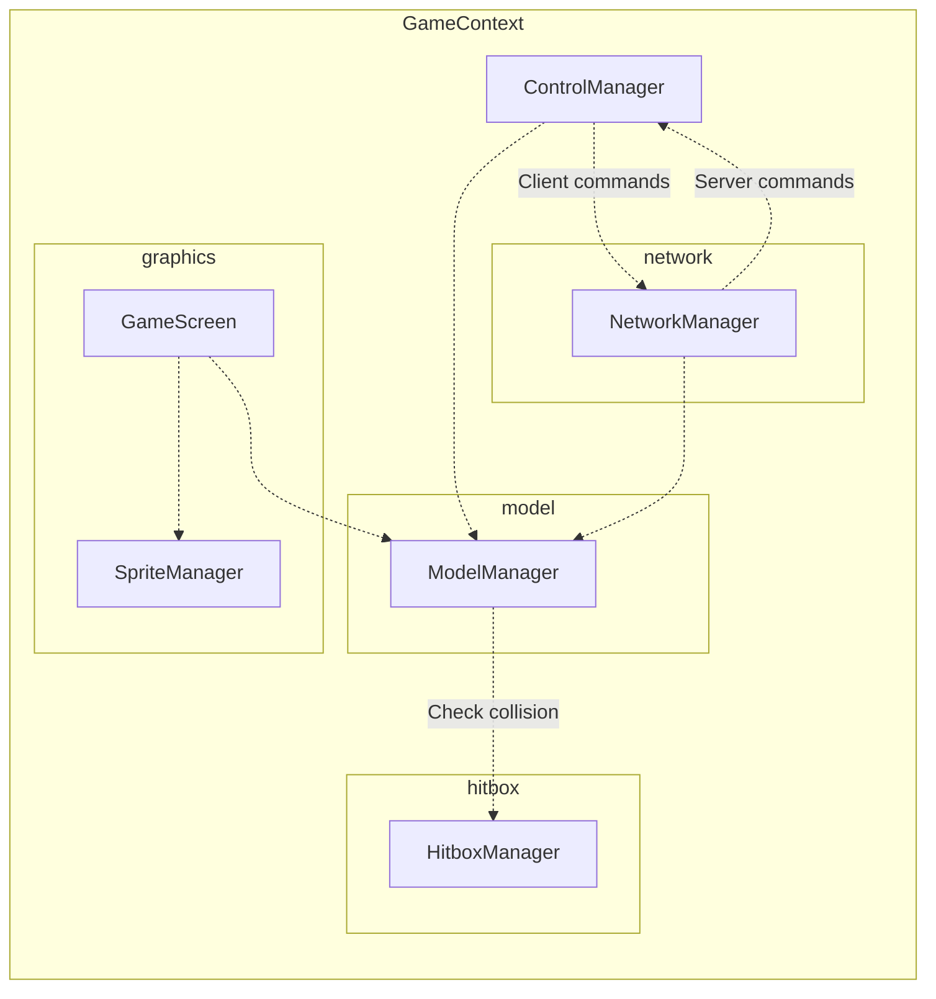

# Architecture

## Overall architecture
```
GameContext
- TimeManager
- ControlManager
- NetworkManager
- ModelManager
- SpriteManager
- HitboxManager
- GameScreen
```

## Interaction graph

```mermaid
graph LR
  subgraph GameContext
    subgraph model
      ModelManager
    end

    subgraph network
      NetworkManager
    end

    subgraph hitbox
      HitboxManager
    end

    subgraph graphics
      GameScreen -.-> SpriteManager;
    end

    ControlManager -.-> |Client commands| NetworkManager;
    NetworkManager -.-> |Server commands| ControlManager;
    ControlManager -.-> ModelManager;
    NetworkManager -.-> ModelManager;

    ModelManager -.-> |Check collision| HitboxManager

    GameScreen -.-> ModelManager;
  end
```
